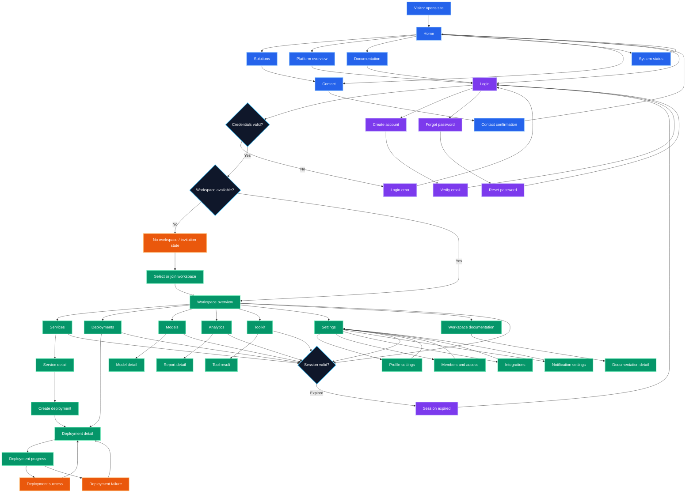

# MarvelCode Frontend Architecture

**Status:** Pre-development frontend blueprint  
**Scope:** Frontend structure only  
**Purpose:** Define the frontend foundation before implementation begins

## 1. Frontend Goal

MarvelCode should be implemented as one frontend application with three coordinated experiences:

1. **Public experience** for visitors, product information, documentation, status, and contact.
2. **Account experience** for sign-in, registration, verification, recovery, and account settings.
3. **Workspace experience** for authenticated users working inside a selected workspace.

These experiences share one frontend codebase, one design-token system, one routing strategy, and one component library. They use different application shells because their navigation and interaction needs are different.

This is a frontend architecture document. Backend services, database design, infrastructure, provider selection, and deployment architecture are outside its scope. The frontend should consume backend capabilities through typed API clients and should not contain server business rules.

## 2. One Frontend Design

```mermaid
flowchart TB
  USER[User]

  subgraph EXPERIENCE[Experience layer · Blue]
    PUBLIC[Public shell]\nLanding · solutions · docs · status
    ACCOUNT[Account shell]\nSign in · registration · recovery
    WORKSPACE[Workspace shell]\nNavigation rail · header · content area
  end

  subgraph APPLICATION[Application layer · Violet]
    ROUTER[Router and route guards]
    FEATURES[Feature modules]
    UI[Shared UI components]
    STATE[Client state and query cache]
    FORMS[Forms and validation]
  end

  subgraph DATA[Data layer · Green]
    CLIENT[Typed API client]
    AUTH[Session and user adapter]
    MOCK[Mock data adapter]
    ERRORS[Error and loading normalization]
  end

  subgraph EXTERNAL[External boundary · Orange]
    API[Application API]
    IDENTITY[Identity service]
    ASSETS[Content and asset delivery]
  end

  USER --> PUBLIC
  USER --> ACCOUNT
  USER --> WORKSPACE
  PUBLIC --> ROUTER
  ACCOUNT --> ROUTER
  WORKSPACE --> ROUTER
  ROUTER --> FEATURES
  FEATURES --> UI
  FEATURES --> STATE
  FEATURES --> FORMS
  STATE --> CLIENT
  ACCOUNT --> AUTH
  CLIENT --> ERRORS
  AUTH --> ERRORS
  CLIENT --> API
  AUTH --> IDENTITY
  PUBLIC --> ASSETS
  CLIENT -. local development .-> MOCK

  classDef blue fill:#2563eb,stroke:#93c5fd,color:#fff,stroke-width:2px;
  classDef violet fill:#7c3aed,stroke:#c4b5fd,color:#fff,stroke-width:2px;
  classDef green fill:#059669,stroke:#6ee7b7,color:#fff,stroke-width:2px;
  classDef orange fill:#ea580c,stroke:#fdba74,color:#fff,stroke-width:2px;
  classDef user fill:#0f172a,stroke:#38bdf8,color:#fff,stroke-width:2px;

  class USER user;
  class PUBLIC,ACCOUNT,WORKSPACE blue;
  class ROUTER,FEATURES,UI,STATE,FORMS violet;
  class CLIENT,AUTH,MOCK,ERRORS green;
  class API,IDENTITY,ASSETS orange;
```

The frontend flow is always:

```text
Route -> feature module -> shared component -> typed data client -> API
```

A page must not call `fetch` directly, read storage directly, or contain authorization rules. Those responsibilities belong to the route/data boundaries.

## 3. Application Shells

### 3.1 Public shell

The public shell owns the global public navigation, footer, content container, responsive menu, SEO metadata, and public loading/error states. It is used by marketing, documentation, security, status, and contact routes.

### 3.2 Account shell

The account shell owns the focused authentication layout, account links, form feedback, session transition states, and recovery navigation. It should not load workspace navigation or private data.

### 3.3 Workspace shell

The workspace shell owns authenticated navigation and layout behavior:

- Workspace selector.
- Primary navigation.
- Collapsible desktop rail.
- Mobile navigation drawer.
- Global search or command entry point.
- Notifications area.
- User menu.
- Breadcrumb or page context.
- Main content region.
- Global toast and modal regions.

The shell renders only after the session and selected workspace have been resolved. It must show explicit loading, no-workspace, unauthorized, and expired-session states.

## 4. Route Architecture

Use route groups that map directly to the three experiences:

```text
src/app/
  (public)/
    layout.tsx
    page.tsx
    solutions/page.tsx
    platform/page.tsx
    documentation/page.tsx
    status/page.tsx
    contact/page.tsx

  (account)/
    layout.tsx
    login/page.tsx
    create-account/page.tsx
    forgot-password/page.tsx
    verify-email/page.tsx

  workspace/
    layout.tsx
    page.tsx
    overview/page.tsx
    services/page.tsx
    deployments/page.tsx
    models/page.tsx
    analytics/page.tsx
    toolkit/page.tsx
    settings/page.tsx

  not-found.tsx
  error.tsx
  loading.tsx
```

Recommended route behavior:

| Route group | Rendering goal | Data sensitivity |
|---|---|---|
| Public | Static or server-rendered where possible | Public |
| Account | Client interaction with server session actions | Personal account data |
| Workspace | Authenticated, workspace-scoped data | Private |

Route guards provide user experience, not security. The API remains the authority for access decisions.

## 5. Page-to-Page Frontend Flow

The editable flow is available in [`FRONTEND_USER_FLOW.mmd`](FRONTEND_USER_FLOW.mmd), with a rendered preview at [`FRONTEND_USER_FLOW.png`](FRONTEND_USER_FLOW.png).

The frontend should be designed as one connected journey. Every page has a clear entry point, next action, back path, and failure path. The following flow is the navigation contract for implementation.



### 5.1 Public-to-account flow

A visitor can browse Home, Solutions, Platform, Documentation, Status, and Contact without authentication. Any action requiring a workspace sends the visitor to Login while preserving the intended destination. For example, selecting a platform action should return the user to the Platform page or continue to the intended workspace destination after successful authentication.

### 5.2 Login flow

The Login page has four outcomes:

| Outcome | Next page |
|---|---|
| Valid credentials and one workspace | Workspace Overview |
| Valid credentials and multiple workspaces | Workspace Selection |
| Valid credentials and no workspace | No Workspace / Invitation |
| Invalid credentials | Login with an inline error |

Login also links to Create Account and Forgot Password. Create Account leads to Verify Email, then returns to Login. Forgot Password leads through Reset Password and returns to Login.

### 5.3 Workspace flow

The Workspace Overview is the authenticated starting page. From there, the user can enter Services, Deployments, Models, Analytics, Toolkit, Documentation, or Settings. The workspace shell remains mounted while the content area changes, so navigation state, selected workspace, and global feedback remain consistent.

The selected workspace must persist during navigation. If the session expires on any workspace page, show the Session Expired state, preserve the safe return path, and send the user through Login before returning them to that page.

### 5.4 Deployment flow

The deployment journey is the first complete operational flow to implement:

```text
Services -> Service Detail -> Create Deployment
        -> Deployment Detail -> Deployment Progress
        -> Success or Failure -> Deployment Detail
```

A deployment page must support loading, validation failure, pending, running, success, failure, cancellation, retry, and permission-denied states. The user must never be shown a successful deployment state until the API confirms it.

### 5.5 Settings flow

Settings is a parent page with focused subsections: Profile, Members and Access, Integrations, and Notifications. Each subsection must provide a clear return path to Settings and preserve the selected workspace. Sensitive changes should require explicit confirmation and display a completed, failed, or pending result state.

### 5.6 Universal frontend states

Every page-to-page transition must account for:

- Loading the next route.
- Invalid or missing route parameters.
- Unsaved form changes.
- Permission denied.
- Expired session.
- Network failure.
- Empty data.
- Successful completion.

These are shared navigation behaviors, not feature-specific exceptions.

## 5. Feature-Based Frontend Structure

Organize frontend code by capability rather than by page type:

```text
src/
  app/                         # route composition and shells
  components/
    ui/                        # generic reusable primitives
    layout/                    # shells, navigation, containers
    feedback/                  # loading, empty, error, toast states
  features/
    public/
      home/
      solutions/
      documentation/
      status/
      contact/
    account/
      login/
      registration/
      recovery/
      verification/
    workspace/
      overview/
      services/
      deployments/
      models/
      analytics/
      toolkit/
      settings/
  data/
    api-client.ts
    query-client.ts
    auth-client.ts
    mock-adapter.ts
    contracts/
  state/
    session-store.ts
    workspace-store.ts
    ui-store.ts
  forms/
    schemas/
    fields/
  design-system/
    tokens.ts
    themes.ts
  lib/
    formatting/
    navigation/
    permissions/
    telemetry/
  types/
    api.ts
    domain.ts
  styles/
    globals.css

  tests/
    unit/
    integration/
    e2e/
```

Each feature should expose a small public surface:

```text
features/workspace/deployments/
  components/
  hooks/
  pages/
  schemas/
  types.ts
  api.ts
  index.ts
```

A feature should not import another feature's internal files. Shared behavior belongs in `components`, `data`, `state`, or `lib` only when it is genuinely shared.

## 6. Component Architecture

Use four component levels:

| Level | Responsibility | Example |
|---|---|---|
| Primitive | Accessible visual behavior with no business knowledge | Button, input, dialog, tabs |
| Pattern | Reusable composition of primitives | Data table, filter bar, metric card, form section |
| Feature | Business-specific interaction and data mapping | Deployment status panel, service health list |
| Page | Route-level composition and loading/error boundary | Deployments page, workspace settings page |

Component rules:

- Primitives receive explicit props and remain data-source agnostic.
- Patterns may accept typed view models but should not know API URLs.
- Feature components own feature-specific query and mutation hooks.
- Pages compose features and define route-level metadata and boundaries.
- Components must support loading, empty, error, disabled, and success states where relevant.
- Avoid a universal `Card` or `Table` with dozens of conditional props; create focused patterns when behavior differs.

## 7. Design Tokens and Theming

The design system should be implemented as tokens, not scattered literal values:

```text
colors: canvas, surface, text, primary, secondary, success, warning, danger
spacing: xs, sm, md, lg, xl, 2xl
radii: control, card, panel, pill
typography: body, label, heading, display, code
motion: fast, normal, slow, reduced
layout: content width, navigation width, header height
```

Use semantic tokens such as `surface-primary`, `text-muted`, and `action-primary` rather than using raw color names throughout feature code. This allows the product to evolve visually without rewriting components.

The token system must include responsive breakpoints, focus-ring styles, disabled states, high-contrast behavior, and reduced-motion behavior. Visual polish should be implemented through shared tokens and components rather than page-specific overrides.

## 8. State Management

Use three separate state categories:

### Server state

Remote data such as services, deployments, models, analytics, and workspace membership belongs in a query/cache layer. It needs caching, invalidation, retry rules, stale-time decisions, and optimistic updates only where safe.

### Session state

Authentication status, current user, available workspaces, selected workspace, and session expiry belong in a dedicated session/workspace store. A refresh must not silently change the selected workspace without an explicit rule.

### UI state

Modals, drawers, filters, tabs, command palette visibility, and temporary form state should remain local to the feature or in a small UI store. Do not put every input and hover state into global state.

The frontend must never treat cached data as proof of permission. Mutations should handle an authorization response by invalidating relevant state and presenting a clear recovery path.

## 9. Data Access Boundary

All backend communication goes through typed clients:

```text
feature hook -> feature API function -> shared API client -> response normalizer
```

The shared client owns base URL handling, headers, correlation IDs, timeout behavior, response parsing, and common error mapping. Feature API functions own endpoint paths and request/response types. Components consume hooks or loaders, never raw HTTP calls.

Example boundary:

```text
getDeployments(workspaceId, filters)
createDeployment(workspaceId, input)
cancelDeployment(workspaceId, deploymentId)
```

During early development, the typed client can switch between a mock adapter and a real API adapter. Both adapters must satisfy the same interface so the UI can be built before backend endpoints are complete.

## 10. Frontend Permissions

The frontend should expose a small permission utility for experience decisions:

```text
can(user, 'deployment.create', workspace)
can(user, 'member.manage', workspace)
can(user, 'settings.read', workspace)
```

Use it to hide or disable actions and to choose navigation visibility. Also handle server authorization failures after a request. Do not duplicate complex policy logic in the frontend; the frontend receives a permission snapshot or capability list from the session/workspace response.

Unauthorized experiences should be distinct:

- **Unauthenticated:** send the user to sign in.
- **Authenticated without workspace membership:** show a workspace-selection or invitation state.
- **Authenticated without permission:** show a clear forbidden state.
- **Expired session:** preserve safe navigation context and request re-authentication.

## 11. Forms and Interaction Patterns

All forms should have:

- Schema-based validation.
- Field-level errors.
- Submission-level errors.
- Disabled and pending states.
- Keyboard submission.
- Focus movement to the first invalid field.
- Success confirmation and safe reset behavior.
- Duplicate-submit protection.

Commands that create, cancel, delete, publish, or deploy must show the current action state and reconcile with server truth. Do not present an optimistic success state for an operation that has not been accepted by the API.

## 12. Loading, Empty, Error, and Offline States

Every route and major feature needs explicit states:

| State | Frontend behavior |
|---|---|
| Loading | Preserve layout shape with a skeleton or progress indicator. |
| Empty | Explain what is missing and provide the next useful action. |
| Error | Show a human-readable explanation, retry action, and support context. |
| Forbidden | Explain that access is unavailable without exposing private details. |
| Session expired | Preserve safe context and provide sign-in recovery. |
| Offline | Prevent unsafe commands and show when the connection returns. |
| Success | Confirm the result and update or invalidate affected queries. |

Create shared boundary components so the behavior remains consistent across routes.

## 13. Responsive and Accessibility Architecture

The frontend must be responsive by layout responsibility, not by shrinking desktop screens:

- Public navigation becomes a mobile menu.
- Workspace navigation becomes a drawer or compact navigation.
- Dense tables provide responsive columns, horizontal scrolling, or a mobile row view.
- Dialogs become full-screen sheets when the viewport requires it.
- Charts provide text summaries or accessible data alternatives.

Target WCAG 2.2 AA. All interactive controls require keyboard access, visible focus, semantic labeling, sufficient contrast, and screen-reader state announcements. Support reduced motion and avoid using color as the only meaning for status.

## 14. Testing Architecture

Use four frontend test levels:

1. **Unit tests:** token utilities, formatters, permission presentation helpers, validators, and state transitions.
2. **Component tests:** primitives, patterns, loading/error states, keyboard behavior, and form validation.
3. **Integration tests:** feature modules against the mock data adapter, including query invalidation and mutation states.
4. **End-to-end tests:** sign-in, workspace selection, navigation, deployment request, settings, and recovery journeys.

Every new feature should test its loading, empty, error, forbidden, success, responsive, and keyboard states. Use visual regression only for stable, high-value shared components rather than every page during the initial build.

## 15. Frontend Development Sequence

### Stage 1 — Frontend foundation

Choose the web framework, routing solution, TypeScript configuration, styling strategy, query/cache library, form library, test tools, and lint/format rules. Create tokens, global styles, error boundaries, and the shared API-client interface.

### Stage 2 — Shared primitives and shells

Build accessible primitives, feedback states, public shell, account shell, workspace shell, navigation, responsive behavior, and route guards using local fixture data.

### Stage 3 — Account and workspace context

Implement session loading, workspace selection, permission snapshot handling, session expiry, and the no-workspace/forbidden states.

### Stage 4 — First vertical frontend slice

Implement one complete workspace feature from route to typed data adapter: list view, detail view, loading state, empty state, error state, mutation, success update, and responsive behavior. Deployments are the recommended first slice because they validate lists, details, status, asynchronous progress, and action feedback.

### Stage 5 — Remaining feature modules

Add services, models, analytics, toolkit, and settings one module at a time. Each module must follow the same feature structure and state conventions.

### Stage 6 — Public and account content

Implement public routes, documentation, status, contact, sign-in, registration, recovery, and verification against stable contracts.

### Stage 7 — Hardening

Run accessibility checks, keyboard testing, responsive testing, bundle analysis, performance checks, error monitoring, visual review of shared components, and end-to-end regression tests.

## 16. Frontend Decisions Required Before Coding

Record these decisions before creating the application scaffold:

- Framework and routing model.
- Rendering strategy for public and authenticated routes.
- Styling and token implementation.
- Component primitive approach.
- Server-state/query library.
- Form and validation approach.
- Mock data strategy and API contract format.
- Authentication/session integration boundary.
- Analytics and error-reporting approach.
- Supported browsers and responsive breakpoints.
- Accessibility testing tools and release threshold.
- Frontend deployment target and environment variables.

## 17. Frontend Definition of Ready

Frontend implementation can begin when the team has agreed on the route map, the three shells, the feature folder convention, the token vocabulary, the server-state strategy, the typed data-client interface, the permission snapshot shape, the required global states, and the first vertical slice.

The first implementation milestone is complete when a user can enter the application, authenticate through a mocked session, select a workspace, navigate the workspace shell, view one feature using typed fixture data, experience loading/empty/error/success states, and use the feature on desktop and mobile with keyboard access.
